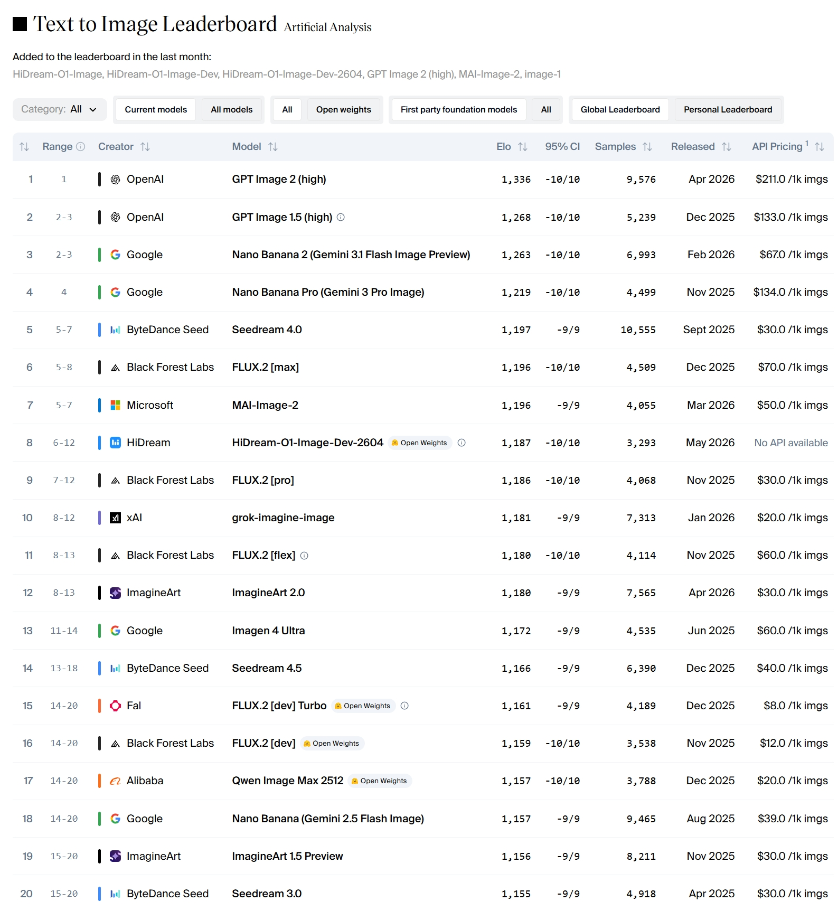
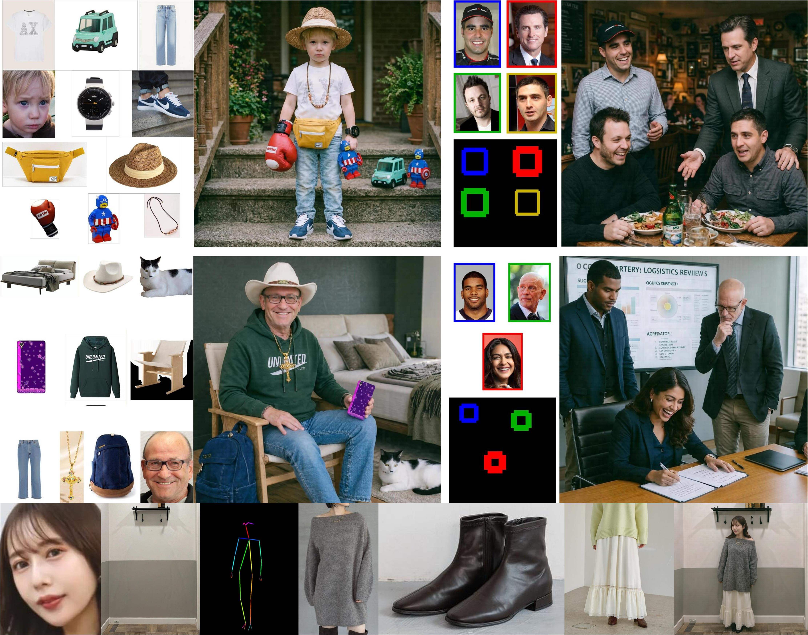

# HiDream-O1-Image

HiDream-O1-Image is a natively unified image generative foundation model built on a Pixel-level Unified Transformer (UiT) without external VAEs or disjoint text encoders, which natively encodes raw pixels, text, and task-specific conditions in a single shared token space — supporting text-to-image, image editing, and subject-driven personalization at up to 2,048 × 2,048.

## Project Updates
- 🚀 **May 14, 2026:** We open-sourced [**HiDream-O1-Image-Dev-2604**](https://huggingface.co/HiDream-ai/HiDream-O1-Image-Dev-2604) with its [prompt refiner](https://huggingface.co/HiDream-ai/Prompt-Refine), tailored for text-to-image generation task.
- 🛠️ **May 13, 2026:** Inference & pipeline updates — accelerated IP inference; the IP pipeline now supports **layout** and **skeleton** conditioning; updated the Dev editing scheduler. For editing tasks we recommend using the **full** model. PyTorch 2.9.x is not recommended due to the [issue](https://github.com/QwenLM/Qwen3-VL/issues/1811).
- 🤗 **May 10, 2026:** Try **HiDream-O1-Image** online on Hugging Face Spaces — [🤗 HiDream-O1-Image](https://huggingface.co/spaces/HiDream-ai/HiDream-O1-Image) and [🤗 HiDream-O1-Image-Dev](https://huggingface.co/spaces/HiDream-ai/HiDream-O1-Image-Dev).
- 📕 **May 10, 2026:** Our **technical report** is now available — [📑 HiDream-O1-Image.pdf](assets/HiDream-O1-Image.pdf).
- 🚀 **May 8, 2026:** We've open-sourced **HiDream-O1-Image (8B)**, including both the undistilled and distilled Dev variants, together with the Reasoning-Driven Prompt Agent.

<div align="center">
  <video src="https://github.com/user-attachments/assets/cbbdb816-f050-4685-aa51-4741479a0e5c" width="70%" poster=""> </video>
</div>

> **HiDream-O1-Image-Dev-2604 debuts at #8 in the Artificial Analysis Text to Image Arena, which is positioned to be the new leading open weights Text to Image model.**
<p align="center">
  
  <br><sub><b>Artificial Analysis Text to Image Arena</b> at up to 2,048 × 2,048.</sub>
</p>

<p align="center">
  
  <br><sub><b>General text-to-image generation</b> at up to 2,048 × 2,048.</sub>
</p>

<p align="center">
  
  <br><sub><b>Long-text rendering & layout control</b> — accurate, multi-region, multilingual text.</sub>
</p>

<p align="center">
  
  <br><sub><b>Subject-driven personalization</b> — preserve identity / IP across new scenes.</sub>
</p>

## Key Features

- 🧬 **Pixel-Level Unified Transformer** — One end-to-end model on raw pixels, no VAE, no disjoint text encoder.
- 🎨 **One Model, Many Tasks** — Text-to-image, long-text rendering, instruction editing, subject-driven personalization, and storyboard generation in a single architecture.
- 🧠 **Reasoning-Driven Prompt Agent** — Built-in "thinking" agent that resolves implicit knowledge, layout, and text rendering before generation.
- 🖼️ **Native High Resolution** — Direct synthesis up to 2,048 × 2,048 with sharp fine-grained detail.
- ⚡ **Exceptional Efficiency and Versatility at 8B Scale** — With only 8B parameters, achieves performance parity with or even surpasses larger open-source DiTs and leading closed-source models.


## Models

| Name | Script | Inference Steps | HuggingFace Repo |
| :--- | :--- | :---: | :--- |
| HiDream-O1-Image | [`inference.py`](./inference.py) | 50 | [🤗 HiDream-O1-Image](https://huggingface.co/HiDream-ai/HiDream-O1-Image) |
| HiDream-O1-Image-Dev | [`inference.py`](./inference.py) | 28 | [🤗 HiDream-O1-Image-Dev](https://huggingface.co/HiDream-ai/HiDream-O1-Image-Dev) |
| Prompt Agent | [`prompt_agent.py`](./prompt_agent.py) | — | [🤗 google/gemma-4-31B-it](https://huggingface.co/google/gemma-4-31B-it) |
| Web Demo | [`app.py`](./app.py) | — | — |
| HiDream-O1-Image-Dev-2604 | [`inference.py` (dev branch)](https://github.com/HiDream-ai/HiDream-O1-Image/blob/dev/inference.py) | 28 | [🤗 HiDream-O1-Image-Dev-2604](https://huggingface.co/HiDream-ai/HiDream-O1-Image-Dev-2604) |
| Prompt Agent 2604 | [`prompt_agent_v2.py` (dev branch)](https://github.com/HiDream-ai/HiDream-O1-Image/blob/dev/prompt_agent_v2.py) | — | [🤗 HiDream-ai/Prompt-Refine](https://huggingface.co/HiDream-ai/Prompt-Refine) |

## Evaluation

We benchmark HiDream-O1-Image against state-of-the-art open-source and proprietary models on five widely-used evaluation suites covering compositional generation, dense prompt alignment, human preference, complex visual text generation, and long-text rendering. In each table, the **best** result is highlighted in bold and the <u>second-best</u> is underlined. Click any benchmark below to expand or collapse.

<details open>
<summary><b>GenEval</b> — compositional generation</summary>

| Model | #Params | Single-Obj | Two-Obj | Count | Color | Position | Attr | Overall |
| :--- | :---: | :---: | :---: | :---: | :---: | :---: | :---: | :---: |
| Nano Banana 2.0 | – | 1.00 | 0.96 | 0.71 | 0.84 | 0.86 | 0.65 | 0.83 |
| Seedream-4.0 | – | 1.00 | 0.92 | 0.71 | 0.93 | 0.78 | 0.68 | 0.84 |
| GPT Image 1 [High] | – | 0.99 | 0.92 | 0.85 | 0.92 | 0.75 | 0.61 | 0.84 |
| GPT Image 2 | – | 0.99 | 0.98 | 0.85 | 0.93 | 0.85 | 0.77 | 0.89 |
| PixArt | 4.3B + 0.6B | 0.98 | 0.50 | 0.44 | 0.80 | 0.08 | 0.07 | 0.48 |
| Show-o | 1.3B | 0.95 | 0.52 | 0.49 | 0.82 | 0.11 | 0.28 | 0.53 |
| Emu3-Gen | 8B | 0.98 | 0.71 | 0.34 | 0.81 | 0.17 | 0.21 | 0.54 |
| SD3-Medium | 5.5B + 2B | 0.98 | 0.74 | 0.63 | 0.67 | 0.34 | 0.36 | 0.62 |
| JanusFlow | 1.3B | 0.97 | 0.59 | 0.45 | 0.83 | 0.53 | 0.42 | 0.63 |
| FLUX.1 [Dev] | 4.8B + 12B | 0.98 | 0.81 | 0.74 | 0.79 | 0.22 | 0.45 | 0.66 |
| SD3.5 Large | 5.5B + 8.1B | 0.98 | 0.89 | 0.73 | 0.83 | 0.34 | 0.47 | 0.71 |
| Janus-Pro-7B | 7B | 0.99 | 0.89 | 0.59 | 0.90 | 0.79 | 0.66 | 0.80 |
| Z-Image-Turbo | 4B + 6B | 1.00 | 0.95 | 0.77 | 0.89 | 0.65 | 0.68 | 0.82 |
| FLUX.2 [Dev] | 24B + 32B | 1.00 | 0.99 | 0.79 | 0.93 | 0.73 | 0.78 | 0.87 |
| Qwen-Image | 7B + 20B | 0.99 | 0.92 | 0.89 | 0.88 | 0.76 | 0.77 | 0.87 |
| **HiDream-O1-Image** | 8B | 1.00 | 0.99 | 0.79 | 0.89 | 0.93 | 0.78 | <u>0.90</u> |
| **HiDream-O1-Image-Pro** | 200B+ | 1.00 | 0.99 | 0.85 | 0.94 | 0.94 | 0.79 | **0.92** |

</details>

<details open>
<summary><b>DPG-Bench</b> — dense prompt alignment</summary>

| Model | #Params | Global | Entity | Attribute | Relation | Other | Overall |
| :--- | :---: | :---: | :---: | :---: | :---: | :---: | :---: |
| GPT Image 1 [High] | – | 88.89 | 88.94 | 89.84 | 92.63 | 90.96 | 85.15 |
| GPT Image 2 | – | 87.27 | 91.91 | 90.85 | 91.59 | 91.58 | 85.98 |
| Nano Banana 2.0 | – | 85.17 | 92.55 | 91.16 | 90.45 | 91.08 | 86.90 |
| Seedream-4.0 | – | 87.17 | 92.41 | 92.29 | 93.33 | 95.48 | 88.63 |
| SD v1.5 | 0.12B + 0.86B | 74.63 | 74.23 | 75.39 | 73.49 | 67.81 | 63.18 |
| PixArt | 4.3B + 0.6B | 74.97 | 79.32 | 78.60 | 82.57 | 76.96 | 71.11 |
| Lumina-Next | 2B + 2B | 82.82 | 88.65 | 86.44 | 80.53 | 81.82 | 74.63 |
| SDXL | 0.81B + 2.6B | 83.27 | 82.43 | 80.91 | 86.76 | 80.41 | 74.65 |
| Hunyuan-DiT | 4.8B + 1.5B | 84.59 | 80.59 | 88.01 | 74.36 | 86.41 | 78.87 |
| Emu3-Gen | 8B | 85.21 | 86.68 | 86.84 | 90.22 | 83.15 | 80.60 |
| DALL-E 3 | – | 90.97 | 89.61 | 88.39 | 90.58 | 89.83 | 83.50 |
| FLUX.1 [Dev] | 4.8B + 12B | 74.35 | 90.00 | 88.96 | 90.87 | 88.33 | 83.84 |
| SD3 Medium | 5.5B + 2B | 87.90 | 91.01 | 88.83 | 80.70 | 88.68 | 84.08 |
| Janus-Pro-7B | 7B | 86.90 | 88.90 | 89.40 | 89.32 | 89.48 | 84.19 |
| Z-Image-Turbo | 4B + 6B | 91.29 | 89.59 | 90.14 | 92.16 | 88.68 | 84.86 |
| HiDream-I1-Full | 13.5B + 17B | 76.44 | 90.22 | 89.48 | 93.74 | 91.83 | 85.89 |
| FLUX.2 [Dev] | 24B + 32B | 92.20 | 91.36 | 93.28 | 93.52 | 89.72 | 87.57 |
| Qwen-Image | 7B + 20B | 91.32 | 91.56 | 92.02 | 94.31 | 92.73 | 88.32 |
| **HiDream-O1-Image** | 8B | 95.15 | 92.32 | 93.74 | 92.88 | 90.25 | <u>89.83</u> |
| **HiDream-O1-Image-Pro** | 200B+ | 94.97 | 95.42 | 92.59 | 90.82 | 89.50 | **90.30** |

</details>

<details open>
<summary><b>HPSv3</b> — human preference across 12 categories</summary>

| Model | #Params | All | Characters | Arts | Design | Architecture | Animals | Natural Scenery | Transportation | Products | Plants | Food | Science | Others |
| :--- | :---: | :---: | :---: | :---: | :---: | :---: | :---: | :---: | :---: | :---: | :---: | :---: | :---: | :---: |
| Seedream-4.0 | – | 9.32 | 9.83 | 9.20 | 8.83 | 9.95 | 8.99 | 9.40 | 9.58 | 9.12 | 9.26 | 9.75 | 9.11 | 9.51 |
| Nano Banana 2.0 | – | 10.01 | 10.18 | 9.18 | 9.58 | 10.96 | 9.71 | 10.04 | 10.38 | 10.36 | 10.14 | 10.61 | 9.14 | 9.89 |
| GPT Image 2 | – | 10.21 | 10.75 | 9.91 | 10.15 | 10.59 | 10.05 | 10.29 | 10.17 | 10.26 | 10.07 | 10.75 | 10.05 | 10.00 |
| Z-Image-Turbo | 4B + 6B | 8.35 | 8.98 | 8.29 | 7.65 | 9.26 | 8.51 | 8.33 | 8.81 | 7.83 | 8.46 | 8.64 | 7.93 | 8.57 |
| FLUX.2 [Dev] | 24B + 32B | 9.28 | 10.23 | 9.56 | 8.80 | 9.73 | 9.43 | 9.21 | 9.44 | 8.93 | 9.23 | 9.82 | 8.67 | 9.11 |
| Qwen-Image | 7B + 20B | 9.94 | 10.91 | 10.47 | 9.56 | 10.22 | 10.61 | 9.87 | 10.10 | 9.15 | 9.99 | 10.08 | 9.19 | 9.83 |
| **HiDream-O1-Image** | 8B | <u>10.37</u> | 10.59 | 10.44 | 10.29 | 11.02 | 10.34 | 10.37 | 10.54 | 10.50 | 10.38 | 10.85 | 9.68 | 10.09 |
| **HiDream-O1-Image-Pro** | 200B+ | **10.47** | 10.63 | 10.51 | 10.33 | 11.11 | 10.08 | 10.45 | 10.37 | 10.75 | 10.29 | 11.13 | 10.09 | 10.39 |

</details>

<details>
<summary><b>CVTG-2K</b> — complex visual text generation (click to expand)</summary>

| Model | #Params | 2 regions | 3 regions | 4 regions | 5 regions | Average | NED | CLIP Score |
| :--- | :---: | :---: | :---: | :---: | :---: | :---: | :---: | :---: |
| Nano Banana 2.0 | – | 0.7465 | 0.7720 | 0.8067 | 0.7980 | 0.7875 | 0.8945 | 0.7212 |
| GPT Image 1 [High] | – | 0.8779 | 0.8659 | 0.8731 | 0.8218 | 0.8569 | 0.9478 | 0.7982 |
| Seedream-4.0 | – | 0.8980 | 0.8949 | 0.9044 | 0.9015 | 0.9003 | 0.9511 | 0.8033 |
| GPT Image 2 | – | 0.8904 | 0.8887 | 0.9101 | 0.9044 | 0.9003 | 0.9515 | 0.7798 |
| TextDiffuser-2 | 0.12B + 0.9B | 0.5322 | 0.3255 | 0.1787 | 0.0809 | 0.2326 | 0.4353 | 0.6765 |
| RAG-Diffusion | 4.8B + 12B | 0.4388 | 0.3316 | 0.2116 | 0.1910 | 0.2648 | 0.4498 | 0.7797 |
| AnyText | 0.123B + 1.2B | 0.0513 | 0.1739 | 0.1948 | 0.2249 | 0.1804 | 0.4675 | 0.7432 |
| 3DIS | 0.81B + 2.6B | 0.4495 | 0.3959 | 0.3880 | 0.3303 | 0.3813 | 0.6505 | 0.7767 |
| FLUX.1 [Dev] | 4.8B + 12B | 0.6089 | 0.5531 | 0.4661 | 0.4316 | 0.4965 | 0.6879 | 0.7401 |
| SD3.5 Large | 5.5B + 8.1B | 0.7293 | 0.6825 | 0.6574 | 0.5940 | 0.6548 | 0.8470 | 0.7797 |
| TextCrafter | 7B + 20B | 0.7628 | 0.7628 | 0.7406 | 0.6977 | 0.7370 | 0.8679 | 0.7868 |
| Qwen-Image | 7B + 20B | 0.8370 | 0.8364 | 0.8313 | 0.8158 | 0.8288 | 0.9116 | 0.8017 |
| Z-Image-Turbo | 4B + 6B | 0.8872 | 0.8662 | 0.8628 | 0.8347 | 0.8585 | 0.9281 | 0.8048 |
| FLUX.2 [Dev] | 24B + 32B | 0.9261 | 0.8897 | 0.8995 | 0.8732 | 0.8926 | 0.9475 | <u>0.8104</u> |
| **HiDream-O1-Image** | 8B | 0.9085 | 0.9159 | 0.9216 | 0.9015 | <u>0.9128</u> | <u>0.9561</u> | 0.8076 |
| **HiDream-O1-Image-Pro** | 200B+ | 0.9133 | 0.9221 | 0.9365 | 0.9175 | **0.9222** | **0.9628** | **0.8349** |

</details>

<details>
<summary><b>LongText-Bench</b> — long-text rendering, EN & ZH (click to expand)</summary>

| Model | #Params | LongText-Bench-EN | LongText-Bench-ZH |
| :--- | :---: | :---: | :---: |
| Seedream-4.0 | – | 0.936 | 0.946 |
| GPT Image 1 [High] | – | 0.956 | 0.619 |
| GPT Image 2 | – | 0.960 | 0.961 |
| Nano Banana 2.0 | – | <u>0.980</u> | 0.965 |
| Janus-Pro-7B | 7B | 0.019 | 0.006 |
| BLIP3-o | 7B + 1.4B | 0.021 | 0.018 |
| Kolors 2.0 | – | 0.258 | 0.329 |
| BAGEL | 7B + 7B | 0.373 | 0.310 |
| OmniGen2 | 3B + 4B | 0.561 | 0.059 |
| X-Omni | 7B | 0.900 | 0.814 |
| HiDream-I1-Full | 13.5B + 17B | 0.543 | 0.024 |
| FLUX.1 [Dev] | 4.8B + 12B | 0.607 | 0.005 |
| Z-Image-Turbo | 4B + 6B | 0.917 | 0.926 |
| FLUX.2 [Dev] | 24B + 32B | 0.963 | 0.757 |
| Qwen-Image | 7B + 20B | 0.943 | 0.946 |
| **HiDream-O1-Image** | 8B | 0.979 | <u>0.978</u> |
| **HiDream-O1-Image-Pro** | 200B+ | **0.982** | **0.980** |

</details>

## Installation

1. Clone this repository:
```bash
git clone https://github.com/HiDream-ai/HiDream-O1-Image.git
cd HiDream-O1-Image
```

2. Install the required dependencies:
```bash
pip install -r requirements.txt
```

> **Note on `flash-attn`.** We highly recommend installing [`flash-attn`](https://github.com/Dao-AILab/flash-attention) for optimized attention computation. **If you do not (or cannot) install `flash-attn`, you must edit `models/pipeline.py` line 341 and change `"use_flash_attn": True` to `"use_flash_attn": False`** — otherwise inference will fail to import the kernel.

## Reasoning-Driven Prompt Agent

HiDream-O1-Image ships with a Reasoning-Driven Prompt Agent (`prompt_agent.py`) that explicitly reasons through layout, subject attributes, physical logic, and text-rendering details, then rewrites a raw user instruction into a self-contained English prompt. It supports two backends — pick one with `--backend`.

The agent prints a JSON object with three fields: `prompt` (rewritten English prompt), `reasoning`, and `resolved_knowledge`. Feed the `prompt` field into `inference.py` for best results on intricate, reasoning-heavy requests.

### Option A — Local Backend (Gemma-4-31B-it)

1. Download the Gemma weights (requires accepting the Gemma license on HuggingFace):
```bash
huggingface-cli download google/gemma-4-31B-it --local-dir /path/to/gemma-4-31B-it
```

2. Run the refiner locally:
```bash
python prompt_agent.py \
    --backend local \
    --model_id /path/to/gemma-4-31B-it \
    --prompt "李白的静夜思写在古墙上"
```

### Option B — External OpenAI-Compatible API

Use any OpenAI-compatible endpoint (OpenAI, Azure, vLLM, SGLang, DeepSeek, etc.) by providing `--base_url`, `--api_key`, and `--model_name`:

```bash
python prompt_agent.py \
    --backend api \
    --base_url https://api.openai.com/v1 \
    --api_key $OPENAI_API_KEY \
    --model_name deepseek-v4-pro \
    --prompt "李白的静夜思写在古墙上"
```

## Usage

A CUDA-capable GPU is required for inference. The examples below use the **undistilled** model (`--model_type full`); see the last subsection for running the same tasks with the **distilled** model (`--model_type dev`).

### 1. Text-to-Image Generation
Generate an image from a text prompt:

```bash
python inference.py \
    --model_path /path/to/HiDream-O1-Image \
    --prompt "medium shot, eye-level, front view. A woman is seated in an ornate bedroom, illuminated by candlelight, with a calm and composed expression. The subject is a young woman with fair skin, light brown hair styled in an updo with loose tendrils framing her face, and blue eyes. She wears a cream-colored satin robe with delicate floral embroidery and lace trim along the neckline. Her ears are adorned with pearl drop earrings. She is seated on a bed with a dark, intricately carved wooden headboard. To her left, a wooden nightstand holds three lit white candles and a candelabra with multiple lit candles in the background. The bed is covered with patterned pillows and a dark, textured blanket. The walls are paneled with dark wood and feature a large, ornate tapestry with muted earth tones. The lighting creates soft highlights on her face and robe, with warm shadows cast across the room." \
    --output_image results/t2i.png \
    --height 2048 \
    --width 2048
```

### 2. Instruction-Based Image Editing
Provide a single reference image and an editing instruction:

```bash
python inference.py \
    --model_path /path/to/HiDream-O1-Image \
    --prompt "remove the earphones" \
    --ref_images assets/edit/test.jpg \
    --output_image results/edit.png \
    --keep_original_aspect
```

### 3. Multi-Reference Subject-Driven Personalization
Provide two or more reference images that define the subject(s), and a prompt that places them in a new scene:

```bash
python inference.py \
    --model_path /path/to/HiDream-O1-Image \
    --shift 1 \
    --prompt "A young boy with blonde hair stands on steps wearing light blue jeans, a white t-shirt with logo, and blue and white sneakers. He wears a brown cord necklace with beads, a black wristwatch with digital display, and carries a yellow fanny pack with white zipper. In his hand is a red boxing glove with white top, a teal plastic toy car, and a plastic toy figure of Captain America. He wears a straw hat with cream band. Natural light illuminates the scene." \
    --ref_images assets/IP/1.jpg assets/IP/2.jpg assets/IP/3.jpg assets/IP/4.jpg assets/IP/5.jpg assets/IP/6.jpg assets/IP/7.jpg assets/IP/8.jpg assets/IP/9.jpg assets/IP/10.jpg \
    --output_image results/subject.png
```

### 4. Multi-Reference Subject-Driven Personalization with Skeleton
```bash
python inference.py \
    --model_path /path/to/HiDream-O1-Image \
    --shift 1 \
    --seed 42 \
    --prompt "Create a realistic try-on image of the person wearing the provided clothing." \
    --ref_images assets/IP_skeleton/0.face.jpg assets/IP_skeleton/0.bg.jpg assets/IP_skeleton/0.openpose.jpg assets/IP_skeleton/0.part_1.jpg assets/IP_skeleton/0.part_2.jpg assets/IP_skeleton/0.part_3.jpg  \
    --output_image results/subject.png
```

### 5. Multi-Reference Subject-Driven Personalization with Layout
```bash
python inference.py \
    --model_path /path/to/HiDream-O1-Image \
    --shift 1 \
    --seed 42 \
    --prompt "City council members pose with relaxed smiles on a sunlit terrace, warm approachable mood, golden hour, cinematic soft glow." \
    --ref_images assets/IP_layout/0.jpg assets/IP_layout/1.jpg \
    --layout_bboxes "[[0.20507812, 0.43945312, 0.48828125, 0.7421875 ], [0.57617188, 0.80078125, 0.08789062, 0.34179688]]" \
    --output_image results/ip_layout.png
```

### 6. Running with the Dev Model
All three tasks above can be run with the **Dev** model by switching `--model_path` to the Dev checkpoint and setting `--model_type dev`. For example:

```bash
python inference.py \
    --model_path /path/to/HiDream-O1-Image-Dev \
    --prompt "A dog holds a sign that says \"HiDream-O1-Image release.\"" \
    --output_image results/t2i_dev.png \
    --model_type dev
```

For **editing** tasks (exactly one reference image), the Dev model defaults to the `flow_match` scheduler. `flow_match` is recommended for editing tasks. Pass `--editing_scheduler flash` to use the flash scheduler instead. This flag has no effect on the `full` model or on non-editing tasks.

### Command Line Arguments

- `--model_path`: Path to the complete HuggingFace model directory (undistilled or distilled).
- `--prompt`: Text prompt for the generation or editing task.
- `--ref_images`: Paths to one or more reference images (optional; space-separated).
- `--output_image`: Path to save the generated image (default: `output.png`).
- `--height` / `--width`: Output image dimensions (default: `2048` × `2048`; values snap to valid resolutions internally).
- `--model_type`: `full` or `dev` (default: `full`). Selects the inference recipe:
  - `full`: 50 steps, guidance scale `5.0`, shift `3.0`, default scheduler.
  - `dev`: 28 steps, guidance scale `0.0`, shift `1.0`, flash scheduler with predefined timesteps. For editing tasks (exactly one reference image), the default scheduler is `flow_match` instead — see `--editing_scheduler`.
- `--seed`: Random seed (default: `32`).
- `--guidance_scale`: Guidance scale (default: `5.0`). Only effective when `--model_type` is `full`.
- `--noise_scale_start`, `--noise_scale_end`: Control the scale of the noise injected by the scheduler at each denoising step; the per-step scale linearly interpolates from `noise_scale_start` (first step) to `noise_scale_end` (last step). See `models/pipeline.py:313` (initial noise) and `models/pipeline.py:323-326` (per-step linear interpolation). Defaults: `7.5`, `7.5`.
- `--noise_clip_std`: Per-step clipping threshold (in units of the injected noise's standard deviation) applied to the noise added during scheduler stepping. See `models/flash_scheduler.py:350-354`. Default: `2.5`.
- `--editing_scheduler`: Scheduler to use for editing tasks (exactly one reference image) when `--model_type dev`. Choices: `flow_match` (default) or `flash`. Ignored for the `full` model and for non-editing tasks.
- `--keep_original_aspect`: When exactly one reference image is provided, resize it with `max_size=2048` and use its dimensions for the target image (preserves the reference's aspect ratio) if `True`. 

## Web Demo

`app.py` is a single-file Flask web UI (with HTML / CSS / JS embedded inline) that exposes all generation modes. It also integrates the Reasoning-Driven Prompt Agent.

### Starting the server

```bash
python app.py \
    --model_path /path/to/HiDream-O1-Image \
    --host 0.0.0.0 \
    --port 7860
```

Then open `http://localhost:7860` in your browser.

### Command-line arguments

| Argument | Default | Description |
| :--- | :--- | :--- |
| `--model_path` | `$HIDREAM_MODEL_PATH` | Path to the checkpoint directory (`HiDream-O1-Image` or `HiDream-O1-Image-Dev`). |
| `--model_type` | `full` | `full` (50-step) or `dev` (28-step). |
| `--host` | `0.0.0.0` | Bind address for the Flask server. |
| `--port` | `7860` | Port for the Flask server. |

All four CLI arguments above can also be set via environment variables (see `.env.example`): `HIDREAM_MODEL_PATH`, `HIDREAM_MODEL_TYPE`, `HIDREAM_HOST`, and `HIDREAM_PORT`.

The Prompt Agent panel in the Web Demo reads additional environment variables from `.env`:

| Env Var | Used by | Description |
| :--- | :--- | :--- |
| `HIDREAM_AGENT_MODEL` | Local · Gemma backend | Path or HF repo id of the local Gemma weights. |
| `OPENAI_BASE_URL` | OpenAI-compatible API backend | Default base URL pre-filled in the UI. |
| `OPENAI_API_KEY` | OpenAI-compatible API backend | Default API key pre-filled in the UI. |
| `OPENAI_MODEL` | OpenAI-compatible API backend | Default model name pre-filled in the UI. |

### Prompt Agent in the UI

The sidebar contains a Prompt Agent panel that calls the same Reasoning-Driven Prompt Agent used by `prompt_agent.py`. Select either the *OpenAI-compatible API* backend (any endpoint, key, and model name) or the *Local · Gemma* backend (set `HIDREAM_AGENT_MODEL` in `.env` or the environment to point to your local Gemma-4-31B-it weights).

### Editing Scheduler (Dev model only)

When the server is launched with `--model_type dev`, the **Edit** tab exposes a *Scheduler* dropdown with two options: `flow_match` (default) and `flash`. The selector is hidden for the `full` model and for the Text → Image / Subject tabs, where the scheduler is fixed.

## License
The code in this repository and the HiDream-O1-Image models are licensed under [MIT License](./LICENSE).
